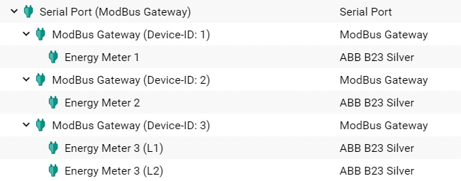
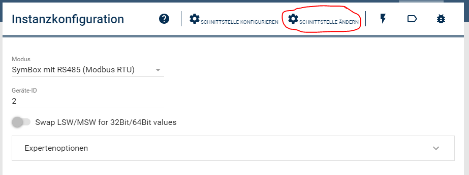

# ABB Energy Meter B21/B23/B24 Steel
Symcon-Modul zum Einbinden der ABB Stromzähler B21, B23 und B24 112-100 (Steel) mit ModBus RTU (RS485).

### Inhaltsverzeichnis

1. [Funktionsumfang](#1-funktionsumfang)
2. [Voraussetzungen](#2-voraussetzungen)
3. [Software-Installation](#3-software-installation)
4. [Einrichten der Instanzen in IP-Symcon](#4-einrichten-der-instanzen-in-ip-symcon)
5. [Statusvariablen und Profile](#5-statusvariablen-und-profile)
6. [WebFront](#6-webfront)
7. [PHP-Befehlsreferenz](#7-php-befehlsreferenz)

### 1. Funktionsumfang

Das Modul liest Werte der ABB Stromzähler aus und speichert sie in Variablen. In der Instanz-Konfiguration kann eingestellt werden, welche Variablen angelegt werden sollen.

Es können mit dem Modul mehrere Stromzähler an einer physikalischen RS485 Schnittstelle betrieben werden. Hierfür müssen für jeden Stromzähler ein ModBus-Gateway und ein ABB B23-Modul angelegt werden.

Die ModBus-Register können in Blöcken vom Gerät ausgelesen werden, um die Auslesegeschwindigkeit zu erhöhen.

### 2. Vorraussetzungen

- IP-Symcon ab Version 5.5
- unterstützte Zähler
- ModBus RTU Schnittstelle (RS485)

### 3. Software-Installation

* Über den Module Store das 'ABB Energy Meter'-Modul installieren.
* Alternativ über das Module Control folgende URL hinzufügen

### 4. Einrichten der Instanzen in IP-Symcon

 Unter 'Instanz hinzufügen' kann das 'ABB Energy Meter B23'-Modul mithilfe des Schnellfilters gefunden werden.  
	- Weitere Informationen zum Hinzufügen von Instanzen in der [Dokumentation der Instanzen](https://www.symcon.de/service/dokumentation/konzepte/instanzen/#Instanz_hinzufügen)

__ABB Energy Meter Instanz Konfigurationsseite__:

|Name      | Beschreibung           |
|----------|------------------------|
|Intervall |Intervall zum Auslesen der Werte in s|
|Variablen |Liste aller verfügbaren ModBus-Register mit Auswahl, für welche Register eine Variable erstellt werden soll|
|Blockweise auslesen| EIN: ModBus-Register werden in Blöcken zusammengefasst ausgelesen. Dies erhöht die Auslesegeschwindigkeit und reduziert die Systemlast. AUS: Jedes ModBus-Register wird einzeln ausgelesen.|

__ModBus Gateway__:

Für jeden Stromzähler wird ein eigenes ModBus Gateway erstellt. Im ModBus Gateway muss der Modus auf "ModBus RTU" gesetzt und die ModBus Geräte-Adresse eingetragen werden, die auch im Stromzähler eingestellt ist.

|Parameter  |Wert   |
|-----------|-------|
|Modus   |**"ModBus RTU"** bzw. **"SymBox mit RS485 (ModBus RTU)"**|
|Geräte-ID   |1..247|
|Swap LSW/MSW|**AUS** (wird durch das Modul gesetzt)|

__Serial Port__:

Die Einstellungen der seriellen Schnittstelle in IP-Symcon müssen mit den Einstellungen des Stromzählers übereinstimmen. Die ABB Stromzähler haben die folgenden Standardeinstellungen (die fett merkierten Werte weichen von den Symcon Standardeinstellungen ab, können aber auch im Zähler verändert werden):

|Parameter  |Wert   |
|-----------|-------|
|Baudrate   |**19200**|
|Datenbits  |8      |
|Stopbits   |1      |
|Parität    |**Even** |

__Einrichtung mehrerer Zähler an einer physikalischen RS485 Schnittstelle__:

Wenn mehrere Zähler an einer physikalischen RS485 Schnittstelle betrieben werden sollen, muss für jeden Zähler ein ModBus Gateway und eine ABB Energy Meter Instanz vorhanden sein (siehe Abbilung). Hierbei ist darauf zu achten, dass jede Geräte-ID (die im Gateway eingestellt wird) nur ein Mal pro Schnittstelle vorkommen darf.

Da für jede ABB Energy Meter Instanz automatisch ein ModBus Gateway und eine IO-Instanz erstellt wird, muss dem ModBus-Gateway noch die korrekte IO-Instantz ("Serial Port" der RS485 Schnittstelle) zugeordnet werden. Dies erfolgt in der ModBus Instanz über den Button "Schnittstelle ändern" (siehe Abbildung).

Sollen einzelne Register eines Zählers in unterschiedlichen IP-Symcon Instanzen dargestellt werden (z.B. pro Phase eine Instanz oder um für verschiedene ModBus-Register des Zählers unterschiedliche Ausleseintervalle einstellen zu können), so können mehrere ABB Energy Meter Instanzen unter einem ModBus Gateway angelegt werden (siehe Abbilung Device-ID 3).,

### 5. Statusvariablen und Profile

Die Statusvariablen/Kategorien werden automatisch angelegt. Das Löschen einzelner kann zu Fehlfunktionen führen.

#### Statusvariablen

Es stehen alle ModBus-Register des Zählers als Statusvariablen zur Verfügung.

#### Profile

Name   | Typ
------ | -------
kVarh  |Float
kVAh   |Float
VA     |Float
Var    |Float
kg     |Float
PhaseAngle|Float

### 6. WebFront

Das Modul und die Variablen können im WebFront angezeigt werden. Es gibt keine Steuerungsmöglichkeiten.

### 7. PHP-Befehlsreferenz

`boolean ABBEM_ReadRequest(integer $InstanzID);`
Liest alle in der Liste der Instanz aktivierten Variablen vom ModBus-Gerät aus und schreibt die aktuellen Werte in die Variablen.

Beispiel:
`ABBEM_ReadRequest(12345);`